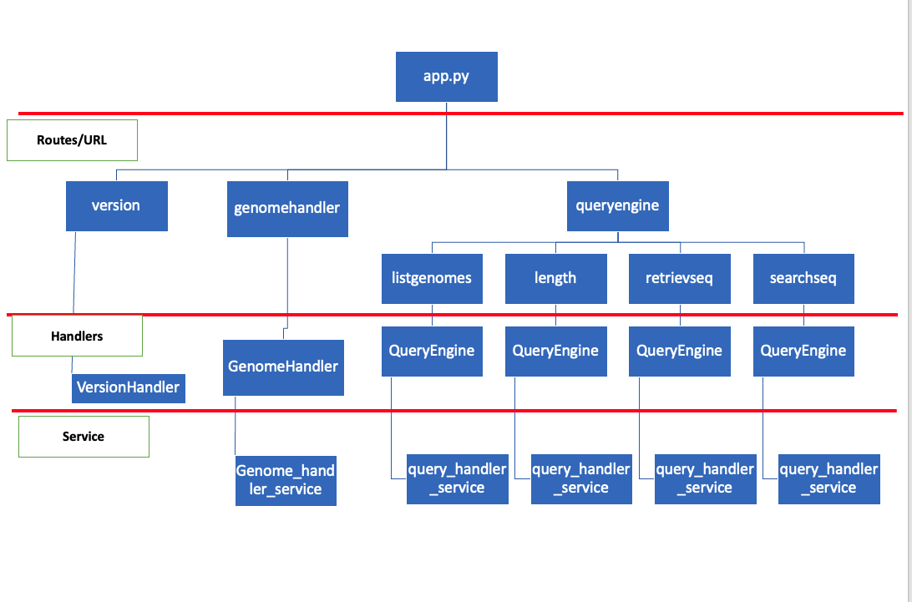

# Code Interview

Thank you for your interest! As part of our candidate interview process, we'd like to get
a sense of your programming ability and style. To that end, we've developed the following programming
scenario that we'd like to invite you to complete.

## Bioinformatic API Server

You are a Bioinformatic software engineer developing a web service to handle genomic data. You have been
provided the following set of main features that need to be included in your initial server:

1. User can register a genome file (user can POST the file and will receive a unique identifier for the registered file):

Files will be of the form:
```
>chromosome1
ACGTACGTACGATCGACAGTCGATCGATCGATCGATCAGCTAGCTA
>chromosome2
GATCGATCGATCAGTCAGTGCTAGCATCGATCGATCGATCGATCGA
```

Files should be stored and can be later looked up by the unique identifier provided in the response.

2. User can query for the names and lengths of chromosomes for a given registered genome using the unique identifier.

3. User can retrieve the sequence of a genomic region of the registered genome, ex:
   chromosome1: 1-5 of the genome in #1 should return ACGTA

4. User can provide a query sequence and genome or genomic region, service will return any substring matches of the
   sequence in the forward direction as well as reverse complement direction on the genome. Service should return
   indices (start and end) of the match.

## Getting Started
A basic backend API application is provided for you in this zip file. Please enhance the code in the application such
that the server has the features enumerated above.

As you develop your server, please treat this exercise as production ready code and include docstrings, tests, etc.
We believe you should be able to complete your web server in a few hours - please don't spend more than four hours!
If you find there are enhancements that you would make to your code given more time, feel free to note them.

### Notes:
- The web service should be treated as a backend only service
- Update the provided README with any additional instructions required to run the server - See Responsed.pdf document in this folder. 
- Feel free to use any additional libraries you want.
  If you do leverage additional libraries, they should be added to the `requirements.txt` file.
- Reverse complement direction refers to reversing the sequence and converting each nucleotide to its complement
  (A->T, C->G, G->C, T->A) e.g. ACTG becomes CAGT

## Quickstart

Create a virtual environment and install prerequisites:

```
python3 -m venv env
source env/bin/activate
pip install -r requirements.txt
```

(You may also use a [conda](https://docs.conda.io/en/latest/miniconda.html)
environment if you prefer.)

To start the service in debug mode (which enables automatic reloading when code
changes are detected):

```
python3 app.py --debug
```


# Responses

## Bioinformatic API Server

You are a Bioinformatic software engineer developing a web service to handle genomic data. You have been provided the following set of main features that need to be included in your initial server:

**Note** 
The below setup uses Python 3.9.6

#### Setup
```
unzip bioinformatic_api_server.zip
cd bioinformatic_api_server
python3 -m venv env
source env/bin/activate
pip install -r requirements.txt
```

#### To run tests
```
# Ensure you are in the bioinformatic_api_server folder.
pytest
```

#### To start the service in debug mode 
(which enables automatic reloading when code changes are detected):

```
python3 app.py --debug
```

#### Test the service
```
curl --request GET --url http://localhost:8080/version
{"api": "1.0.0", "tornado": "6.1"}
```

#### A representation of the codeflow is below. 



For query functions, pysam is primarily used (in combination with biopython as required), since pysam provides an easy way to random access an indexed fasta file.

## Requirements
1. User can register a genome file (user can POST the file and will receive a unique identifier for the registered file). Files should be stored and can be later looked up by the unique identifier provided in the response.

```
# Change FASTA file path below 
curl --request POST \
  --url http://localhost:8080/genomehandler \
  --form fasta_file=@/path/to/bioinformatic_api_server/sample.fasta

#Response
{
    "api_version": "1.0.0",
    "data": {
        "uploaded_files": [
            {
                "filename": "sample.fasta",
                "unique_identifier": "d22678dc02da4771b39dfb0495e493f1"
            }
        ]
    },
    "status": 200
}
```

**Make a note of the `unique_identifier`, it is required for all subsequent steps.**

Files are stored in `app_data/uploads` folder, with meta data added to `app_data/genome_register.csv` file. In an ideal case, a database would be used to store this information, along with more meta data. 

Users can query all available genomes available using the command below. 

```
curl --request GET \
  --url http://localhost:8080/queryengine/listgenomes

#Response  
{
	"api_version": "1.0.0",
	"data": {
		"d22678dc02da4771b39dfb0495e493f1": {
			"unique_identifier": "d22678dc02da4771b39dfb0495e493f1",
			"upload_path": "app_data/uploads/d22678dc02da4771b39dfb0495e493f1.fa",
			"upload_name": "sample.fasta"
		}
	},
	"status": 200
}
```
**Note: Create a bash variable `unique_identifier=<unique_identifier>` so that the curl commands below can be directly used to test the service**

```
unique_identifier=d22678dc02da4771b39dfb0495e493f1
```

2. User can query for the names and lengths of chromosomes for a given registered genome using the unique identifier.

The URL to query for lengths is `localhost:8080/queryengine/length/` and it takes two query parameters

a) `uid` (Required) - unique identifier that was received when the genome was registered.  
b) `sequence_region` (Optional) - Name of a sequence in the query fasta file. Allowed formats - `chromosome1`. Specifying specific regions (`chromosome1:1-10`) would return an error.  

If both parameters are provided, the service returns the length of the specific sequence. If only `uid` is specified, length of all sequences in the FASTA file is returned. 

```
curl --request GET \
  --url "http://localhost:8080/queryengine/length/?uid=$unique_identifier"

#Response
{
	"api_version": "1.0.0",
	"data": {
		"chromosome1": "46",
		"chromosome2": "46"
	},
	"status": 200
}
```

```
curl --request GET \
  --url "http://localhost:8080/queryengine/length/?uid=$unique_identifier&sequence_region=chromosome1"

#Reponse
{
	"api_version": "1.0.0",
	"data": {
		"chromosome1": "46"
	},
	"status": 200
}
```

3. User can retrieve the sequence of a genomic region of the registered genome, ex:
   chromosome1: 1-5 of the genome in #1 should return ACGTA

The URL to query for lengths is `localhost:8080/queryengine/retrieveseq/` and it takes two query parameters  
a). `uid` (Required) - unique identifier that was received when the genome was registered.  
b). `sequence_region` (Required) - Name of a sequence and region in the query fasta file. Allowed formats - `chromosome1`, `chromosome1:1-5`.  

```
curl --request GET \
  --url "http://localhost:8080/queryengine/retrieveseq/?uid=$unique_identifier&sequence_region=chromosome1%3A1-5"

#Response
{
	"api_version": "1.0.0",
	"data": ">chromosome1:1-5\nACGTA\n",
	"status": 200
}
```

4. User can provide a query sequence and genome or genomic region, service will return any substring matches of the sequence in the forward direction as well as reverse complement direction on the genome. Service should return indices (start and end) of the match.

The URL to query for lengths is `localhost:8080/queryengine/searchseq/` and it takes three query parameters
a) `uid` (Required) - unique identifier that was received when the genome was registered.  
b) `sequence_region` (Required) - Name of a sequence and region in the query fasta file. Allowed formats - `chromosome1`, `chromosome1:1-5`.  
c) `query` (Required) - Sequence to search.  

**NOTE**  
a) Search only returns the first hit, does not return all hits.  
b) While finding matches in a subsequence of a FASTA record (i.e chromosome1:1-10), the service returns coordinates corresponding to the start and end of the subsequence.  
c) Service response `Reverse complement direction` refers to the coordinates in reverse complement direction of the FASTA record.  
d) Service can be modified to report the coordinates in a different orientation or relative to the entire FASTA record, if required.  

```
#Search for the string ACG in the entire sequence of chromosome1
curl --request GET \
  --url "http://localhost:8080/queryengine/searchseq/?uid=$unique_identifier&sequence_region=chromosome1&query=ACG"

#Response
{
	"api_version": "1.0.0",
	"data": {
		"chromosome1": {
			"forward_direction": "1-3",
			"reverse_compliment_direction": "39-41"
		}
	},
	"status": 200
}
```

```
#Search for the string ACG in a part of the sequence.i.e. chromosome1:1-10
curl --request GET \
  --url "http://localhost:8080/queryengine/searchseq/?uid=$unique_identifier&sequence_region=chromosome1%3A1-10&query=ACG"

#Response
{
	"api_version": "1.0.0",
	"data": {
		"chromosome1:1-10": {
			"forward_direction": "1-3",
			"reverse_compliment_direction": "3-5"
		}
	},
	"status": 200
}
```

## Known limitations of the API server
1. FASTA file has to be in a valid format (same sequence length across all lines etc)
2. The service has only been tested with small FASTA file. Due to the way the uploaded FASTA files are read, the service will likely fail for large file uploads. It appears there are file size limitations set by tornado. In a production setting, we can get around it a couple of ways
    a) Use set_max_body_size(max_body_size) to specify a larger file size limit.  
    b) Read data in chunks as suggested in Tornado docs, instead of loading everything.  
    c) Upload it to a storage service say S3 and return a URL to access the file.  

## Possible improvements for production use...

* Validate all input files - extensions and content
* Store uploaded files metadata in a database, store more info depending on requirements.
* Human readable unique file identifier - say using a combination of file name and uuid?
* Add ORM + DB migration tools to handle database operations 
* Have pysam indexing as a async task, separate it from the current setup.
* Split the `sequene_region` parameter used in the query handler to `sequence` and `region` seperately, for better handling. 
* Implement comprehensive regex checks for `sequence` headers, `region` values.
* Account for large fasta files (say human genome) when it comes to upload, index, search, query - take advantage of async feature
* Account for API time out issues since this service will likely involve processsing large sized files.
* Auto create upload folders during startup
* If more features are required with FASTA, biopython would be the ideal tool to use. 
* Better error handling.
* Improve test cases and tests
	- Write tests for genome handler functions. 
	- Write tests for API endpoints - create a fixture for the application, get/post to end point and compare. 
* Authentication mechanism.  
* Make it a python package for easy deployment.  
