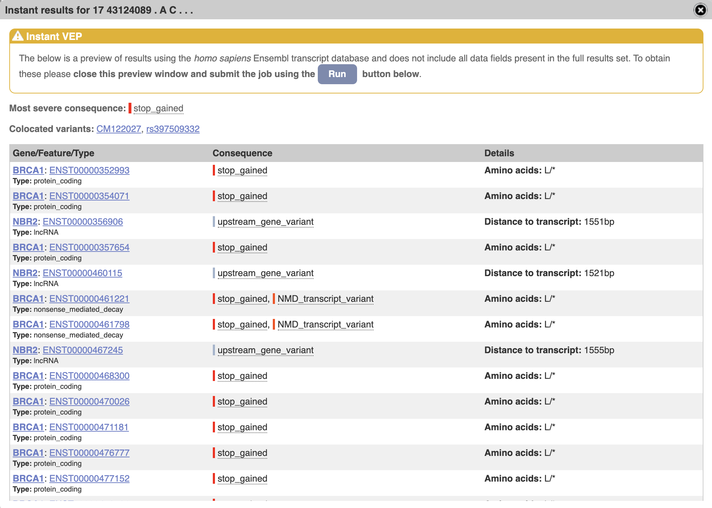

# Coding Challenge

Senior Design Informatics Engineer Coding Challenge.

For these challenges, please provide all Python code you generated. You are encouraged to use existing packages to help you.


In the scenario below, you are tasked with compiling an input file to the Engineering Portal that instructs Designer software to create editing cassette designs for our customer to order.  The format of this file is attached, and you will find that it is filled in with several example rows. During the process of creating this file, please carefully document the process you used so that other collaborators can reproduce your work. Include all code and input files that you used to generate this file as well as instructions on setting up an environment to run your code (for example, a requirements.yaml for setting up a conda environment). You are limited to specifying substitution, insertion, and deletion edits that are no longer than 63 NT. Please do not manually fill out this CSV file. You must create this file using software that you have written for this challenge. 

## Scenario 1:

A customer would like to knock-out BRCA1 in one of the human cell lines supported by the company, and they would like your advice about how to best knock-out this gene. Provide for this customer a library of at least 96 options so that they can screen for the best KO design. Some ways to knock-out a gene are to: substitute an in-frame codon with a stop codon, insert a stop codon in-frame, or delete nucleotides to create a frame-shift mutation. Please consider the GRCh38 reference assembly for this task.

Notes:
1.	The format of the CSV is the same for all organisms. 
2.	Please do not attempt to use the design software web interface. Only use the provided CSV format. The challenge is aimed at assessing the process you use to decide what edits to make, the biological knowledge you apply when choosing edits, and the quality of the code you write to build out the final CSV file. You can assume you are the customer or that you are helping a customer to create this CSV file.
3.	You can assume that genomes and annotations available, and customers are allowed to upload custom genomes and annotations. If you input an argetType that is “Specific Genes” or “Specific CDS” (as opposed to “Chromosome”), you can provide the gene name as the TargetName.

## Response

The goal of this task is to come up with a minimum viable product that identifies mutations in a human gene, that would cause a knock out in the same gene. There are several methods to approach this question. A few are listed below -

a) Public databases - Find all nonsense, frameshift variants from a public database such as ClinVar, Ensembl, dbSNP and
then progressively apply filters.

b) Sequence Record based - Read each nucleotide/codon, make changes that would introduce a stop codon, map it back to
one of the allowed coordinate systems.

c) Exhaustive search - generate all possible substitution, insertions and deletions of a given length in a gene, predict
functional impact and then progressively apply filters.

I have implemented a program based on **option (c)** 
- `variant_generator.py` that takes in command line arguments below
- `--target_type`
  , `--gene_name`, `--variation_length`, variant type flags (`--substitutions`, `--insertions`,
  `--deletions`) and `--output_file_path` to generate a number of mutations that would cause a KO in a gene.

- #### The program generates mutations across all exons in the canonical transcript of a gene as well as the top 20% of most used exons in the same gene.

- The top % value is currently hardcoded but can be made a command line parameter. 

- Desired functional effects have been hard coded at this point, to return "ExonLoss", "FrameShiftTruncation", "
  PrematureStop" variants. This can also be made a command line argument if required.

- This program has mainly been implemented with the help of two python packages

  - [PyEnsembl](https://github.com/openvax/pyensembl) - PyEnsembl is a Python interface to Ensembl reference genome
    metadata such as exons and transcripts. PyEnsembl downloads GTF and FASTA files from the Ensembl FTP server and loads
    them into a local database.
  - [Varcode](https://github.com/openvax/varcode) - Varcode is a library for working with genomic variant data in Python
    and predicting the impact of variants on protein sequences.

  - Both of these programs require some datasets to be downloaded and present in the data folder. See Quick Start below.


#### Code flow
  - call main()
  - parse click command line arguments
    - call generate_variants()
      - Get gene, transcript information from transcript_utils.py
      - Get FASTA sequence form other_utils.py
      - Generate insertions/deletions/substitutions and filter by KO effect using variant_utils.py
      - Return variants
  - Write to output file. 

## Quick Start

**Note - Below setup utilizes Python 3.9.6**

1. Unzip the folder and cd into it.

```
unzip design_engineer_coding_challenge_v6.zip
cd design_engineer_coding_challenge_v6
base_folder=`pwd` #subsequent commands in this example use this. 
```

2. Create a virtual environment and install required packages.

```
python3 -m venv env
source env/bin/activate
pip install -r requirements.txt
```

3. Setup Pyensembl Cache data path and download pyensembl cache.

**Note**

- The cache has to be located in the data folder available in the root folder (
  design_engineer_coding_challenge_v6)
- This is currently hardcoded, but can me made a command line input (or) have the script download the required files.

```
export PYENSEMBL_CACHE_DIR=${base_folder}/data
pyensembl install --release 104 --species human
# A few FutureWarning lines will show up, they can be ignore. 
```

4. To predict functional impact of a variant, reference and alternate bases are required. Reference bases are obtained
   from indexed FASTA file.

Since we are only generating variants in BRCA1 gene, it is sufficient to download chromosome 17 FASTA file. In a
production use case or for generating variants in genes present in other chromosomes, we will have to download the
entire genome FASTA file (or all individual chromosome fasta files). Install samtools and index the FASTA file if the
python command below fails.

```
cd ${base_folder}/data

# Single line command
curl -O  http://ftp.ensembl.org/pub/release-104/fasta/homo_sapiens/dna/Homo_sapiens.GRCh38.dna.chromosome.17.fa.gz

gunzip Homo_sapiens.GRCh38.dna.chromosome.17.fa.gz

# Single line command
python -c "import pysam; pysam.faidx('Homo_sapiens.GRCh38.dna.chromosome.17.fa')"
```
5. Run tests (**Incomplete**)
```
cd ${base_folder}
pytest
```

6. Now run the program.

```
cd ${base_folder}

python3 variant_generator.py --help
Usage: variant_generator.py [OPTIONS]

  Program to generate variants of a desired effect in a human
  gene/transcript/exon. Run variant_generator.py --help for information on
  input parameters. Default path to output design file is
  "Human_{gene_name}_variants.csv"

Options:
  --target_type [gene|transcript|exon]
                                  Type of annotation target to introduce
                                  variants in  [required]
  --gene_name TEXT                HGNC Approved Gene Name. Required if
                                  target_type is gene, ignored otherwise
                                  [required]
  --variation_length TEXT         Lengths of
                                  Insertions,Deletions,Substitutions to
                                  simulate. Comma seperated list  [default: 1]
  --substitutions / --no-substitutions
                                  Flag to generate substitutions  [default:
                                  substitutions]
  --insertions / --no-insertions  Flag to generate insertions  [default: no-
                                  insertions]
  --deletions / --no-deletions    Flag to generate deletions  [default: no-
                                  deletions]
  --output_file_path TEXT         Path for output design file to write
  --help                          Show this message and exit.

```

**--target_type transcript and exon have not been implemented.**

7. To generate

- All KO substitutions of length 1bp in the BRCA1 gene, run

```
python3 variant_generator.py --target_type gene \
  --gene_name BRCA1 --variation_length 1 --substitutions \
  --output_file_path ./results/Human_BRCA1_1bp_substitutions.csv
```

- All KO substitutions of length 1bp and 2bp in the BRCA1 gene, run

```
python3 variant_generator.py --target_type gene \
 --gene_name BRCA1 --variation_length 1,2 \
 --substitutions \
 --output_file_path ./results/Human_BRCA1_1_2_bp_substitutions.csv
```

- All KO substitutions, insertions of length 1bp and 2bp in the BRCA1 gene, run

```
python3 variant_generator.py --target_type gene \
 --gene_name BRCA1 --variation_length 1,2 \
 --substitutions --insertions \
 --output_file_path ./results/Human_BRCA1_1_2_bp_subs_ins.csv
```

- For a different gene, change the `--gene-name` value (ensure indexed FASTA file for the chromosome corresponding to
  the gene is available)
- To generate deletions, add `--deletions` flag
- To generate variations of more lengths, add it to `--variation_length` seperated by a comma.Ex: `1,2,3` or `2,3`.

8. To spot check any one result, check variant effects in Ensembl VEP online - [link](https://uswest.ensembl.org/Tools/VEP) 

```
tail -n1 ./results/Human_BRCA1_1bp_substitutions.csv
# Substitution,Chromosome,,chr17,Nucleotide,Specific Position,43124089,,,,C,
```


### Limitations/Possible improvements

- The goal was to deliver a MVP, I am sure there are edge cases I haven't accounted for. Example - Variations
  near intronic sequences and their effects.
- Sanitize input data - if gene name is a valid ensembl entry and other CLI parameters
- Check if data sources are available and inform user.
- Better way is for the program to auto download and manage the data.
- More tests/test cases
- Generalize this output csv writing part; avoid hard coding the format
- Have a config file to specify environmental variables, Ensembl rest API end point and other parameters.
- For variations of larger length, see if complexity can be reduced.
- Add CLI to introduce variants in specific transcripts
- Add CLI to introduce variants in specific exons
- Add CLI to introduce variant across all exons available for a gene (including less frequently used exons or a set % of most used exons)
- Add CLI to introduce variants with a sepcific functional effect (such as silent variants, frameshift variants etc.)


