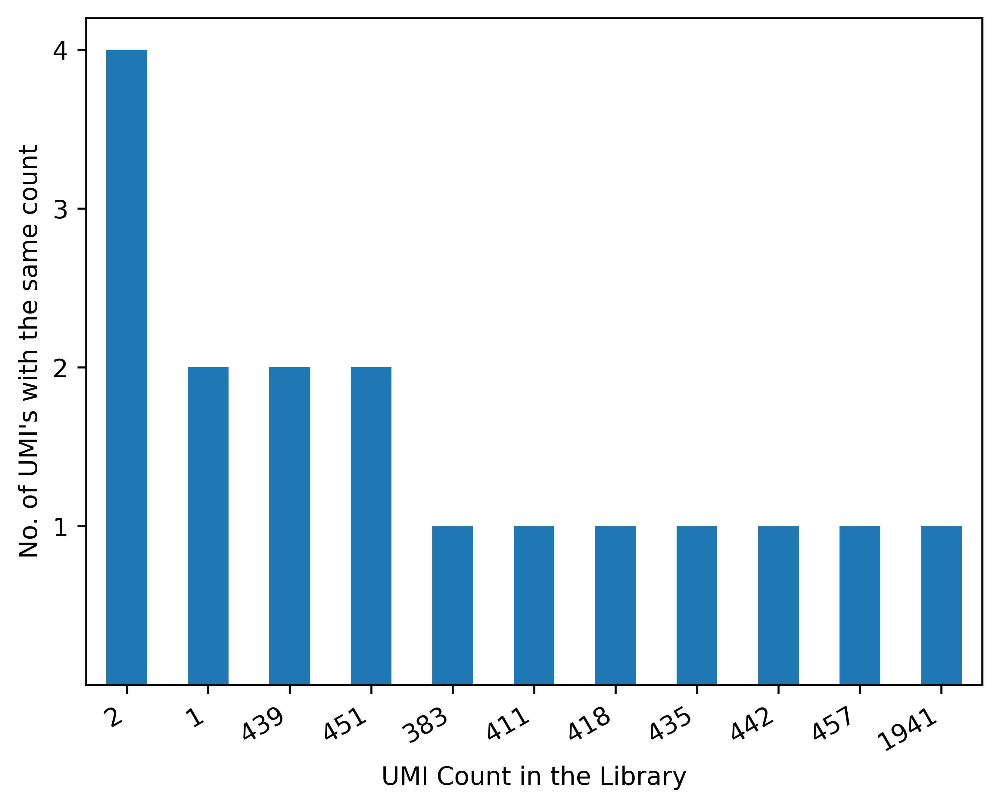
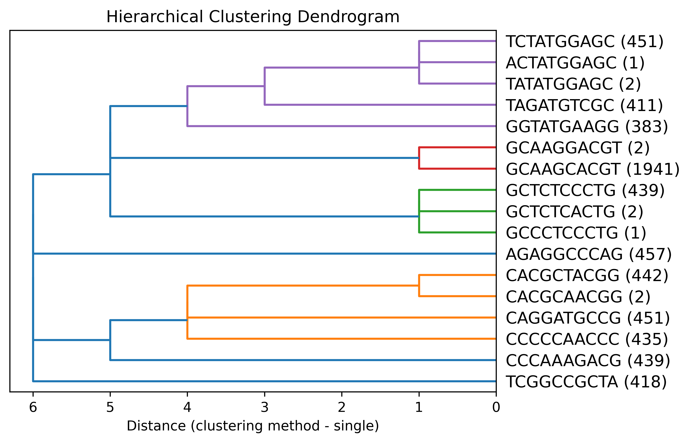

# Bioinformatics Coding Test
 
The following construct containing a 10bp UMI (random barcode)  was randomly inserted into many locations in the PhiX genome: 5’ CTCGACAA-NNNNNNNNNN- AAGGGGAG 3’  .  A standard Illumina library was made and sequenced as single-end for 150 bp. The attached fastq file (singTest.fastq.gz) contains these reads with adapters already trimmed.  To make things easier:
 
- Each read contains only 1 UMI within the complete construct (each read has CTCGACAA-NNNNNNNNNN- AAGGGGAG).   
- There are no errors in the regions flanking the UMI (CTCGACAA or AAGGGGAG).   
- All reads have the same orientation relative to the PhiX genome (i.e. you don’t need to consider reverse complement).  

Please write a program to:  
1: Identify the UMI for each read  
2: Determine the number of Unique UMIs in the library (Report this value)  
3: Plot a UMI Frequency distribution (X-axis: Number of times a barcode was observed in the library; Y-axis: Number of barcodes observed that many times)   
4: Cluster UMIs based on Hamming Distance and plot a dendrogram to visualize UMI clustering. Include information about how many of each UMI were present in the library on the plot.  
5: Assume that all UMIs that vary by a Hamming Distance <= 2 are actually the same UMI, but they vary because of sequencing error.  For example, you observe the UMI “AAAAA” 100 times and UMI “AAATA” 1 time.  “AAATA” is a mis-sequenced “AAAAA”. Using just the UMI sequences, calculate the sequencing error (number of correctly called bases / total called bases).  
 
 
Besides a program that works correctly, we are looking for the following in the code:  
Documentation of code and how to use  
Modularization of code  


## Program description

I have implemented a python program to parse fastq file and generate plots and report metrics as described in the challenge . The program utilizes a couple of published python packages to do this. A few are listed below. 

- pyfastx - a python module for fast random access to sequences from plain and gzipped FASTA/Q file
- Levenshtein -  Python C extension module contains functions for fast computation of string distances. 
- scipy, pandas, numpy and matplotlib.

Note - 
* My goal was to deliver a minimum viable product, there might be certain approaches that are not optimal or edge cases I haven't considered. 
* UMIs are extracted from each read use regex.  
* Any pair of UMI's with a hamming distance of 3 or greater are considered unique.

See code flow and quick start for more details.

### Code flow

`parse_fastq.py` is the main script. It calls functions in two other scripts in the utilities folder. `umi_utils.py` and `plotting_utils.py`

- Run program
- Call main
  - Parse command line arguments
  - call `umi_utils.extract_umi_from_fastq` extract UMI's. Write df to file.
  - call `umi_utils.get_unique_umi_counts` to get UMI counts. Write df to file. 
  - call `plotting_utils.create_umi_frequency_distribution_graph` to obtain and plot UMI count frequency distribution
  - Write UMI count frequency distribution to file.
  - generate hamming distance matrix using `umi_utils.calculate_pairwise_hamming_distance`. Write df to file. 
  - Plot dendrogram by calling `plotting_utils.create_dendrogram`
  - Find similar UMI's using `umi_utils.find_similar_umis`
  - Collapse UMI's and find error bases using `umi_utils.collapse_umis_find_error_bases`
  - Calculate total UMI bases using `umi_utils.calculate_total_umi_bases_sequenced`
  - Report Percentage of accurately called bases.


## Setup

1. Setup the environment and install required packages. 

**Note** 
 - The below setup uses Python 3.8.11

```
unzip genomics_coding_challenge.zip
cd genomics_coding_challenge
conda env create -f ./environment.yml
conda activate genomics_v1
export PATH=$CONDA_PREFIX/bin:$PATH # In case if there is an issue with path
```

1. Run the program and view help command

```
python parse_fastq.py --help

Usage: parse_fastq.py [OPTIONS]

Options:
  --input_fastq PATH              Input FASTQ file to extract UMI from. Can be
                                  gzipped  [required]
  --umi_prefix TEXT               UMI Prefix  [required]
  --umi_suffix TEXT               UMI Suffix  [required]
  --dendrogram_clustering_method [single|complete|average|weighted]
                                  Method to be used for clustering while
                                  generating a dendrogram, based on Hamming
                                  distances. See https://docs.scipy.org/doc/sc
                                  ipy/reference/generated/scipy.cluster.hierar
                                  chy.linkage.html#scipy.cluster.hierarchy.lin
                                  kage  [required]
  --help                          Show this message and exit.
```

3. Now run the program with the test dataset. All results are stored to data folder.

```
python parse_fastq.py --input_fastq singTest.fastq.gz \
    --umi_prefix CTCGACAA --umi_suffix AAGGGGAG \
    --dendrogram_clustering_method single

INFO:root:Parsing FASTQ file and extracting UMI's from reads
INFO:root:Writing dataframe to file ./data/UMI_in_each_read.txt
INFO:root:Obtaining unique UMI count
INFO:root:Writing dataframe to file ./data/Unique_UMI_Sequence_Counts.txt
INFO:root:There were 17 unique UMI's in the FASTQ file
INFO:root:Plotting UMI Count Frequency distribution
INFO:root:UMI Frequency Distribution plot saved to ./data/UMI_Count_Frequency_distribution.png
INFO:root:Writing dataframe to file ./data/UMI_Count_Frequency_Table.txt
INFO:root:Calculating pairwise hamming distance
INFO:root:Writing dataframe to file ./data/UMI_Hamming_Distance_Table.txt
INFO:root:Plotting dendrogram
INFO:root:Finding similar UMI's and calculating incorrectly sequenced bases
INFO:root:Percentage of accurately called bases - (number of correctly called bases / total called bases)*100
INFO:root:Percentage of accurately called bases is 99.984068822686%
```

## Responses to questions

1. Identify the UMI for each read
   
   UMI is extracted from each read and is available in `./data/UMI_in_each_read.txt` file. 

2. Determine the number of Unique UMIs in the library (Report this value)

    There were 17 unique UMI's in the FASTQ file. This is reported in the program logs

    ```INFO:root:There were 17 unique UMI's in the FASTQ file```

3. Plot a UMI Frequency distribution (X-axis: Number of times a barcode was observed in the library; Y-axis: Number of barcodes observed that many times)

    UMI Count Frequency distribution was plotted and is available at "./data/UMI_Count_Frequency_distribution.png". 

    

4. Cluster UMIs based on Hamming Distance and plot a dendrogram to visualize UMI clustering. Include information about how many of each UMI were present in the library on the plot.

    UMI's were clustered based on hamming distance (clustering method - single; see https://docs.scipy.org/doc/scipy/reference/generated/scipy.cluster.hierarchy.linkage.html#scipy.cluster.hierarchy.linkage ). The plot is available at `./data/UMI_Dendrogram_single.png`. The clustering method is a command line parameter and can be changed. The UMI counts are indicated within parentheses in the label.

    

5. Assume that all UMIs that vary by a Hamming Distance <= 2 are actually the same UMI, but they vary because of sequencing error.  For example, you observe the UMI “AAAAA” 100 times and UMI “AAATA” 1 time.  “AAATA” is a mis-sequenced “AAAAA”. Using just the UMI sequences, calculate the sequencing error (number of correctly called bases / total called bases).
   
   All UMI pairs with 0 < hamming distance <= 2 were considered as the same. The UMI with the most count was considered to be the correct UMI. Other UMI's with lesser count were considered to have an incorrect base. 

   Based on the hamming distance between the correct UMI, "close" UMI and the count of "close" UMI, the total number of incorrect bases was calculated - hamming distance between UMI's * count of "close" UMI. 

   Total UMI bases was calculated as follows - sum (length of UMI * UMI count in the library) for all unique UMI's. 

   ** UMI's had 10 errors. Total UMI bases is 62770. Correctly called bases is 62760.  **
   ** Percentage of accurately called bases is 99.98 **

   This is reported in the logs. 

    ```
    INFO:root:Percentage of accurately called bases - (number of correctly called bases / total called bases)*100
    INFO:root:Percentage of accurately called bases - (62760 / 62770)*100
    INFO:root:Percentage of accurately called bases is 99.984068822686%
    ```

## Possible improvements
* Write tests
* Check for edge cases while parsing hamming distance matrix
* For large sequence files, storing sequence headers and UMI's in a dataframe will probably be inefficient. To store sequence headers or not depends on the use case. We can do away with it 
    - Write UMI and sequence headers to file instead of a dataframe. 
    - Store UMI counts in a Counter dictionary. 
* Explore more on dendrogram clustering methods and which is suited best for hamming distance. Certain clustering methods favor euclidean distance (ward) and they have not been included here. 
